# Laboratorio N° 3 — Control de Versiones Avanzados

> **Documento fuente:** `GLAB-S03-2026-02-1.docx`
> **Curso:** Construcción y Pruebas de Software — IV Ciclo
> **Institución:** TECSUP
> **Docente:** Jaime Gómez
> **Semana:** 3 · **Actividad:** Realizar control de versiones
> **Imágenes extraídas:** 46 (carpeta [`imagenes/`](imagenes/))

---

## Tabla de contenidos

1. [Objetivos](#1-objetivos)
2. [Equipos, materiales, programas y recursos](#2-equipos-materiales-programas-y-recursos)
3. [Seguridad](#3-seguridad)
4. [Introducción](#4-introducción)
5. [Preparación](#5-preparación)
6. [Procedimiento y resultados](#6-procedimiento-y-resultados)
   - [6.1 Creación de Proyecto Java con Maven](#61-creación-de-proyecto-de-java-con-maven)
   - [6.2 Cambios en el Proyecto — Branch `sprint-1`](#62-cambios-en-el-proyecto--branch-sprint-1)
   - [6.3 Unificación `main` ← `sprint-1` (merge)](#63-unificación-main--sprint-1-merge)
   - [6.4 Tag de versión estable `v1.0.0`](#64-generar-la-versión-estable-v100-tag-del-main)
7. [Ejercicio adicional — Calificado (`sprint-2`)](#7-ejercicio-adicional--calificado)
8. [Conclusiones](#8-conclusiones)
9. [Criterios de evaluación (rúbrica)](#9-criterios-de-evaluación--rúbrica)
10. [Anexo A — Catálogo completo de imágenes analizadas](#anexo-a--catálogo-completo-de-imágenes-analizadas)
11. [Anexo B — Chuleta de comandos Git equivalentes](#anexo-b--chuleta-de-comandos-git-equivalentes)
12. [Anexo C — Observaciones y hallazgos del análisis](#anexo-c--observaciones-y-hallazgos-del-análisis)

---


---

## 1. Objetivos

- Uso de **branches** en proyectos
- Uso de **merges** en proyectos
- Uso de **Tags** en proyectos

## 2. Equipos, materiales, programas y recursos

- PC Personal.
- Sistema operativo Windows XP o superior.
- Material disponible desde Tecsup Virtual.
- Conexión a red.

> **Nota del análisis:** aunque el documento indica Windows, **todas las capturas del laboratorio fueron tomadas en macOS** (barra de menús de Apple, atajos ⌘/⌥, rutas `~/git`, `/Users/developer`, Keychain Access). Ver [Anexo C](#anexo-c--observaciones-y-hallazgos-del-análisis).

## 3. Seguridad

- Colocar las mochilas en el gabinete al final del salón para evitar caídas en caso de sismo.
- No ingresar con bebidas ni comidas.
- Apagar los equipos y los monitores al culminar la sesión.

## 4. Introducción

En los proyectos en Java es necesario almacenar la información en repositorios de software. En este laboratorio se usa **Git** y el uso de **branch**, **merge** y **tags**.

## 5. Preparación

El alumno debe revisar previamente el material del curso en Tecsup Virtual y revisar su texto.

---

## 6. Procedimiento y resultados

**Condiciones iniciales:** se recomienda el grupo de proyectos integradores.

El laboratorio se trabaja con **dos roles**:

| Rol | Responsabilidad |
|---|---|
| **Responsable** | Crea el repositorio remoto, el proyecto Maven, otorga permisos, crea branches y tags, y realiza los merges hacia `main`. |
| **Colaborador(es)** | Acepta la invitación, clona el repositorio, hace checkout de los branches remotos, aporta cambios y sincroniza (pull/push). |

---

### 6.1 Creación de Proyecto de Java con Maven

#### 6.1.1 [Responsable] Crear un repositorio principal en GitHub: `cps_lab03b`

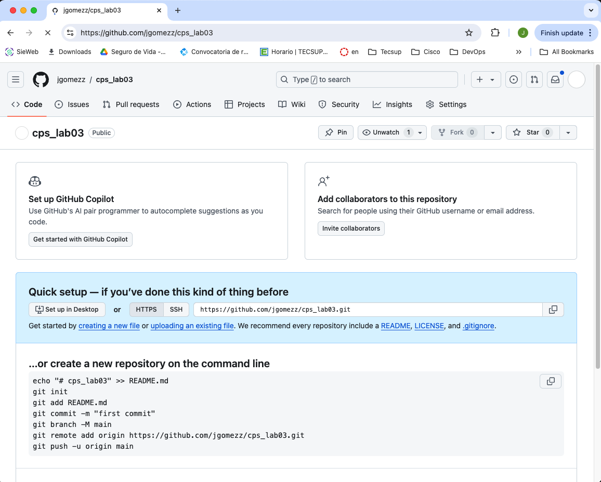

**Análisis de la imagen (fig. 02 — `image28.png`)**

Navegador Chrome en macOS mostrando `https://github.com/jgomezz/cps_lab03` — la pantalla de **quick setup** de un repositorio vacío:

- Cabecera: `jgomezz / cps_lab03`, etiqueta **Public**. Contadores en cero: Fork 0, Star 0, Unwatch 1.
- Barra de pestañas del repo: Code · Issues · Pull requests · Actions · Projects · Wiki · Security · Insights · Settings.
- Tarjeta izquierda **“Set up GitHub Copilot”**; tarjeta derecha **“Add collaborators to this repository”** con el botón **Invite collaborators** — esta es la puerta de entrada al paso 6.1.2.
- Bloque azul **“Quick setup”**: selector `HTTPS | SSH` y la URL de clonado `https://github.com/jgomezz/cps_lab03.git`.
- Bloque **“…or create a new repository on the command line”**, con la receta canónica:

```bash
echo "# cps_lab03" >> README.md
git init
git add README.md
git commit -m "first commit"
git branch -M main
git remote add origin https://github.com/jgomezz/cps_lab03.git
git push -u origin main
```

> ⚠️ **Discrepancia:** el texto del enunciado pide crear el repositorio llamado **`cps_lab03b`**, pero todas las capturas usan **`cps_lab03`** (sin la `b`). Es la nomenclatura real que se sigue en el resto del laboratorio.

#### 6.1.2 [Responsable] Dar permisos de colaboración en GitHub a "Colaborador"

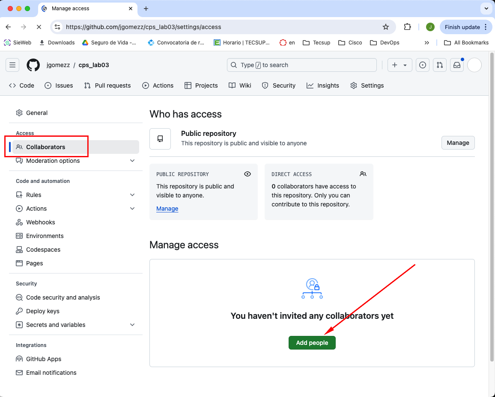

**Análisis de la imagen (fig. 03 — `image27.png`)**

Página `https://github.com/jgomezz/cps_lab03/settings/access` (**Settings → Collaborators**):

- El menú lateral izquierdo está agrupado en: **Access** (Collaborators ← *resaltado con recuadro rojo*, Moderation options), **Code and automation** (Rules, Actions, Webhooks, Environments, Codespaces, Pages), **Security** (Code security and analysis, Deploy keys, Secrets and variables), **Integrations** (GitHub Apps, Email notifications).
- Panel **“Who has access”**: *Public repository* — “This repository is public and visible to anyone”.
- Tarjeta **DIRECT ACCESS**: “**0 collaborators** have access to this repository. Only you can contribute to this repository.”
- Sección **Manage access** con el estado vacío “You haven't invited any collaborators yet” y el botón verde **Add people**, señalado por una **flecha roja** — es el clic que hay que dar.

**Ruta de clic:** `Settings → Collaborators → Add people → [usuario GitHub del colaborador] → Add to repository`.

> **NOTA (del documento):** Confirmar la invitación en el correo del colaborador(es).

#### 6.1.3 [Colaborador(es)] Verificar que tiene acceso al repositorio compartido

Sin captura en el documento. Se verifica abriendo la URL del repositorio y comprobando que aparece en la lista de repos del colaborador.

#### 6.1.4 [Responsable] Crear un proyecto de Java con Maven

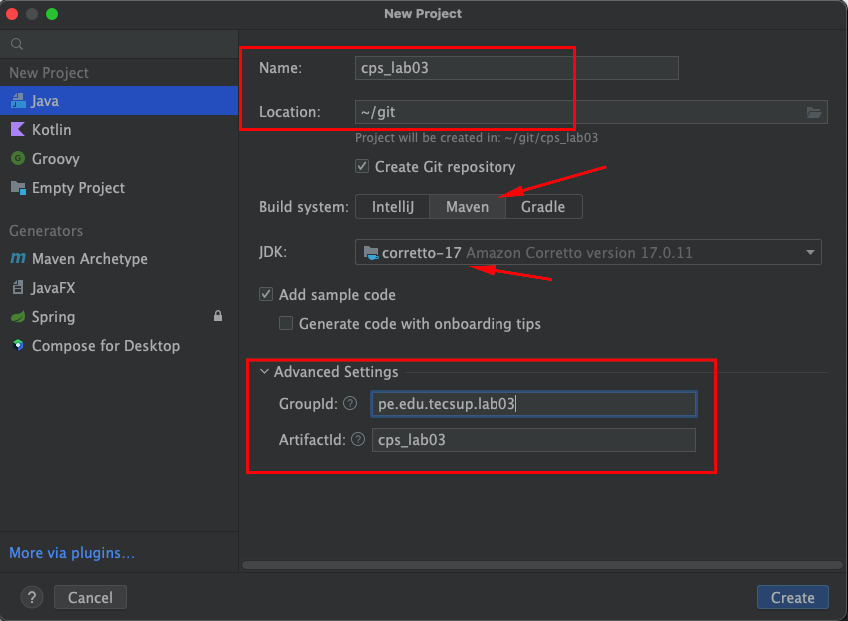

**Análisis de la imagen (fig. 04 — `image29.png`)**

Diálogo **New Project** de IntelliJ IDEA (tema oscuro, macOS). Configuración exacta a replicar:

| Campo | Valor | Marca en la captura |
|---|---|---|
| Generador (izquierda) | **Java** (seleccionado en azul; también hay Kotlin, Groovy, Empty Project, Maven Archetype, JavaFX, Spring, Compose for Desktop) | — |
| **Name** | `cps_lab03` | recuadro rojo |
| **Location** | `~/git` → “Project will be created in: `~/git/cps_lab03`” | recuadro rojo |
| **Create Git repository** | ✅ **marcado** (crítico: inicializa `git init` automáticamente) | — |
| **Build system** | **Maven** | flecha roja |
| **JDK** | `corretto-17` (Amazon Corretto 17.0.11) | flecha roja |
| **Add sample code** | ✅ marcado (genera `Main.java`) | — |
| Generate code with onboarding tips | ☐ desmarcado | — |
| **Advanced Settings → GroupId** | `pe.edu.tecsup.lab03` | recuadro rojo |
| **Advanced Settings → ArtifactId** | `cps_lab03` | recuadro rojo |

Botones inferiores: **Cancel** / **Create**.

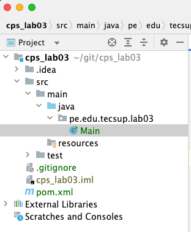

**Análisis de la imagen (fig. 05 — `image36.png`)**

Panel **Project** de IntelliJ con el árbol recién generado, breadcrumb `cps_lab03 › src › main › java › pe › edu › tecsup…`:

```
cps_lab03  ~/git/cps_lab03
├── .idea
├── src
│   ├── main
│   │   ├── java
│   │   │   └── pe.edu.tecsup.lab03
│   │   │       └── Main            ← clase generada por "Add sample code"
│   │   └── resources
│   └── test
├── .gitignore
├── cps_lab03.iml
└── pom.xml
External Libraries
Scratches and Consoles
```

Confirma que Maven creó el layout estándar (`src/main/java`, `src/main/resources`, `src/test`) y que Git ya está activo (existe `.gitignore`).

#### 6.1.5 Crear la clase `pe.edu.tecsup.lab03.Application`

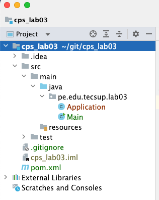

**Análisis de la imagen (fig. 06 — `image30.png`)**

Mismo panel Project, ahora con **dos clases** dentro del paquete `pe.edu.tecsup.lab03`:

- **`Application`** — nombre en **rojo/naranja** → archivo **nuevo, sin trackear** por Git.
- **`Main`** — nombre en **verde** → archivo **agregado al repositorio local**.
- `.gitignore` y `cps_lab03.iml` en tonos verde/oliva.

Esta captura es la que da sentido a la leyenda de colores del documento.

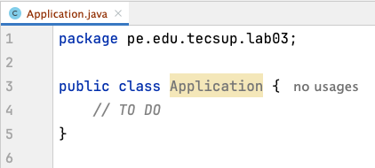

**Análisis de la imagen (fig. 07 — `image32.png`)**

Editor con la pestaña `Application.java` (ícono `C` naranja = archivo modificado/no versionado). Contenido íntegro, 5 líneas:

```java
package pe.edu.tecsup.lab03;

public class Application {   // no usages
    // TO DO
}
```

El hint gris **“no usages”** es del inspector de IntelliJ. La clase es intencionalmente un esqueleto vacío.

**Leyenda de colores de Git en IntelliJ (según el documento):**

| Color | Significado |
|---|---|
| 🔴 **Rojo** | archivo nuevo, **sin trackear** |
| 🟢 **Verde** | archivo en el **repositorio local** (agregado/versionado) |
| ⚪ **Gris** | archivo **omitido** (ignorado) |

#### 6.1.6 Subir el proyecto al repositorio local

##### a) Subir los cambios al Stage Area (`git add`)

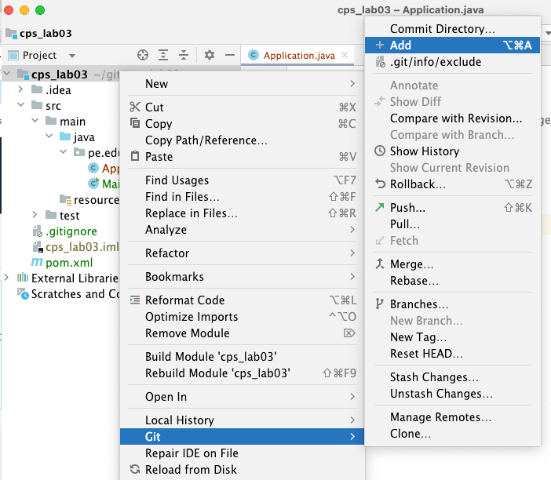

**Análisis de la imagen (fig. 08 — `image37.png`)**

Ventana `cps_lab03 – Application.java`. Se hizo **clic derecho sobre la raíz del proyecto** `cps_lab03` y se desplegó el menú contextual; dentro, la entrada **Git** (resaltada en azul) abre el submenú de la derecha, donde está seleccionado en azul **+ Add ⌥⌘A**.

El submenú Git completo que se ve (y que reaparece en varias capturas) contiene:

- Commit Directory… · **+ Add ⌥⌘A** · .git/info/exclude
- Annotate · Show Diff · Compare with Revision… · Compare with Branch… · Show History · Show Current Revision · Rollback… ⌥⌘Z
- **Push… ⇧⌘K** · Pull… · Fetch
- **Merge…** · Rebase…
- **Branches…** · New Branch… · **New Tag…** · Reset HEAD…
- Stash Changes… · Unstash Changes…
- Manage Remotes… · Clone…

Nótese que en esta captura *New Branch…* y *New Tag…* aparecen **atenuados (deshabilitados)** porque todavía no existe ningún commit.

**Equivalente CLI:** `git add .`

##### b) Subir los cambios del Stage Area al Repositorio Local (`git commit`)

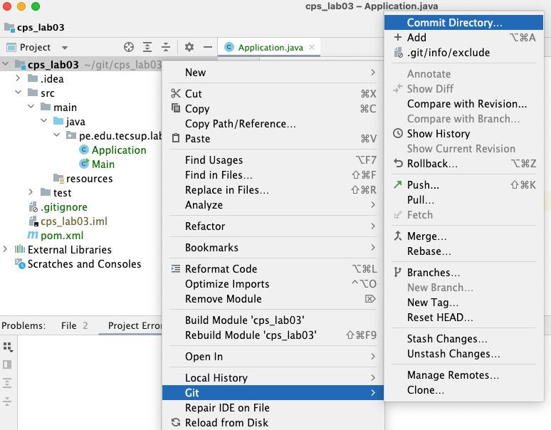

**Análisis de la imagen (fig. 09 — `image45.png`)**

Misma ventana; ahora la opción resaltada en la parte superior del submenú Git es **Commit Directory…**. En el árbol ya se ven `Application` y `Main` ambos en **verde** (ya pasaron por *Add*). En la parte inferior asoma la barra de herramientas *Problems: File 2 | Project Error…*.

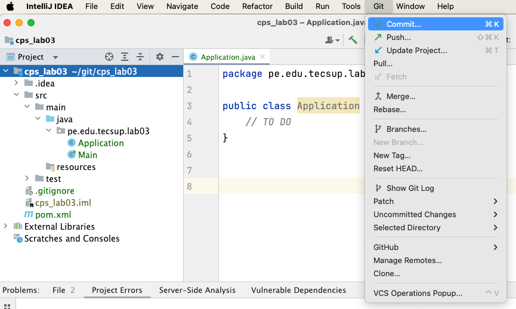

**Análisis de la imagen (fig. 10 — `image43.png`)**

Vía alternativa: la **barra de menús** de macOS → menú **Git** desplegado. Opciones visibles y sus atajos:

- ✅ **Commit… ⌘K** (resaltado en verde)
- ↗ Push… ⇧⌘K
- ⬇ Update Project… ⌘T
- Pull… · Fetch (gris)
- **Merge…** · Rebase…
- **Branches…** · New Branch… (gris) · New Tag… · Reset HEAD…
- Show Git Log · Patch ▸ · Uncommitted Changes ▸ · Selected Directory ▸
- GitHub ▸ · Manage Remotes… · Clone…
- VCS Operations Popup… ⌃V

Al fondo, el editor muestra `Application.java` con el mismo esqueleto, y el árbol con `Application` y `Main` en verde.

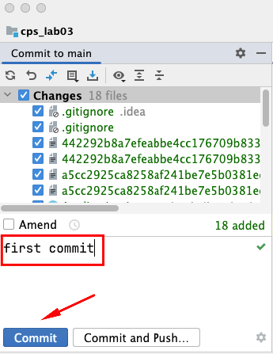

**Análisis de la imagen (fig. 11 — `image31.png`)**

Herramienta **Commit** de IntelliJ, título de pestaña **“Commit to main”** (confirma que el branch por defecto es `main`):

- Nodo **Changes — 18 files**, todos con checkbox marcado. Se distinguen dos `.gitignore` (`.idea/.gitignore` y el raíz) y varios archivos con nombre de hash SHA (`442292b8a7efeabbe4cc176709b83…`, `a5cc2925ca8258af241be7e5b0381e…`) — corresponden a metadatos internos de `.idea`.
- Casilla **Amend** desmarcada; a la derecha, en verde, el resumen **“18 added”**.
- Caja de mensaje de commit con el texto **`first commit`**, enmarcada en **rojo**; el check verde a la derecha indica mensaje válido.
- Botones: **Commit** (azul, señalado por **flecha roja**) y **Commit and Push…**.

**Equivalente CLI:** `git commit -m "first commit"`

#### 6.1.7 Para visualizar el proyecto

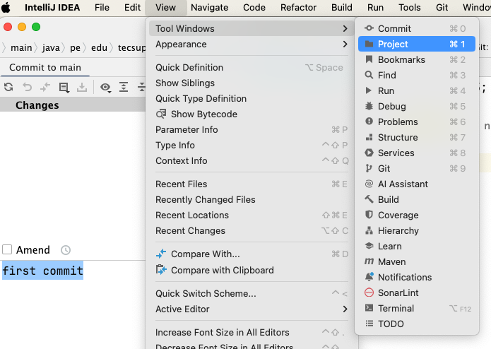

**Análisis de la imagen (fig. 12 — `image39.png`)**

Menú **View → Tool Windows** desplegado, con el submenú completo de ventanas de herramientas y sus atajos numéricos:

| Ventana | Atajo | Ventana | Atajo |
|---|---|---|---|
| Commit | ⌘0 | Structure | ⌘7 |
| **Project** (resaltado) | **⌘1** | Services | ⌘8 |
| Bookmarks | ⌘2 | **Git** | **⌘9** |
| Find | ⌘3 | AI Assistant · Build · Coverage · Hierarchy · Learn · Maven · Notifications · SonarLint | — |
| Run | ⌘4 | Terminal | ⌥F12 |
| Debug | ⌘5 | TODO | — |
| Problems | ⌘6 | | |

Al fondo se ve todavía la pestaña **Commit to main** y el mensaje `first commit` seleccionado en azul.

**Atajos clave a memorizar:** `⌘1` Project · `⌘9` Git · `⌘0` Commit · `⌥F12` Terminal.

#### 6.1.8 Subir el proyecto del repositorio local al repositorio remoto

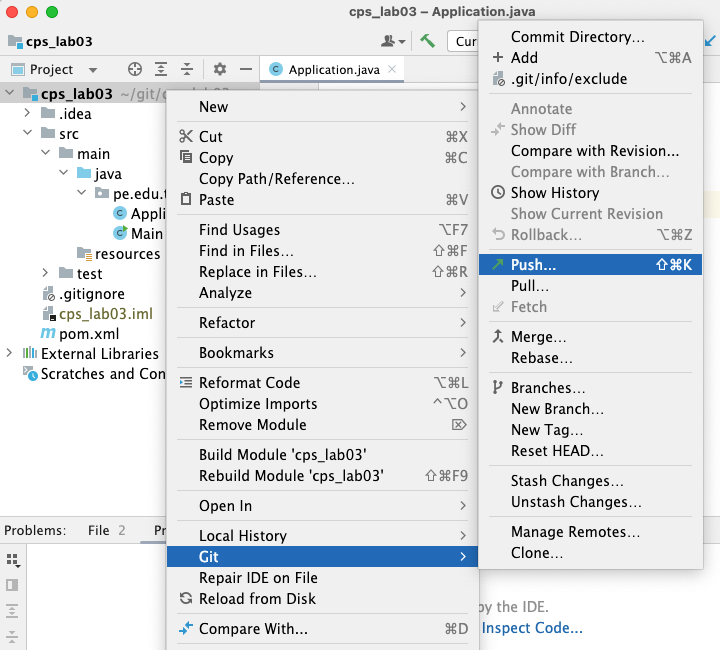

**Análisis de la imagen (fig. 13 — `image38.png`)**

Clic derecho en `cps_lab03` → **Git ▸** → **Push… ⇧⌘K** resaltado en azul (con flecha verde ↗). Ahora sí **New Branch…** y **New Tag…** aparecen habilitados, porque ya existe el `first commit`.

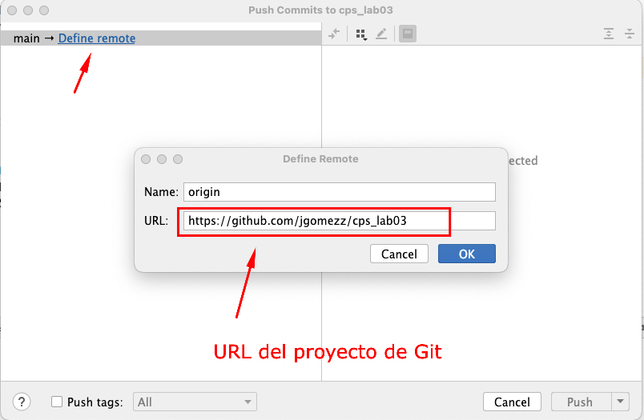

**Análisis de la imagen (fig. 14 — `image34.png`)**

Diálogo **Push Commits to cps_lab03**. Como el proyecto no tiene remoto configurado, en la fila superior aparece `main → ` **Define remote** (enlace azul, señalado por flecha roja). Al pulsarlo se abre el modal **Define Remote**:

| Campo | Valor |
|---|---|
| **Name** | `origin` |
| **URL** | `https://github.com/jgomezz/cps_lab03` (enmarcado en rojo) |

Leyenda manuscrita en rojo bajo el diálogo: **“URL del proyecto de Git”**. Botones **Cancel** / **OK**. Abajo la casilla **Push tags: All** (desmarcada) y **Cancel / Push**.

**Equivalente CLI:** `git remote add origin https://github.com/jgomezz/cps_lab03.git`

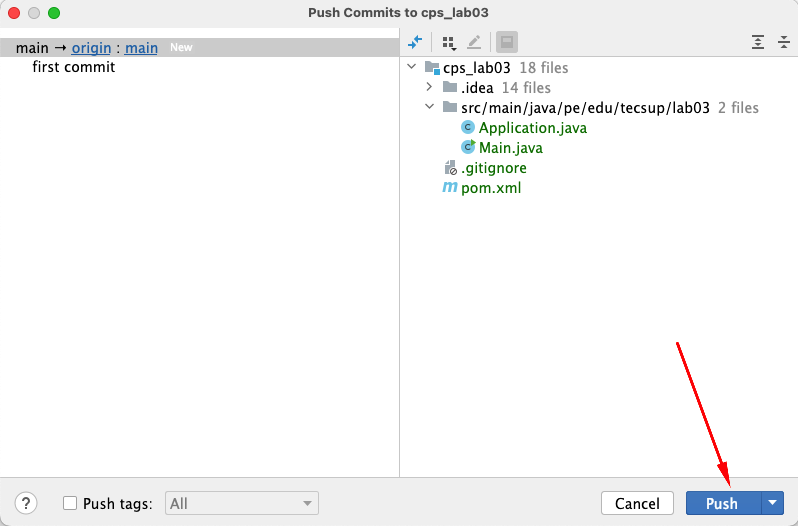

**Análisis de la imagen (fig. 15 — `image33.png`)**

Mismo diálogo, ya resuelto: la cabecera muestra **`main → origin : main`** con la etiqueta verde **New** (el branch remoto se creará). En el panel izquierdo, el commit **`first commit`**. En el panel derecho, el detalle de los archivos que viajan:

```
cps_lab03            18 files
├── .idea            14 files
├── src/main/java/pe/edu/tecsup/lab03   2 files
│   ├── Application.java
│   └── Main.java
├── .gitignore
└── pom.xml
```

Una **flecha roja** apunta al botón azul **Push** (con desplegable). La casilla *Push tags: All* sigue desmarcada.

**Equivalente CLI:** `git push -u origin main`

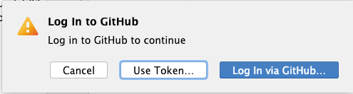

**Análisis de la imagen (fig. 16 — `image44.png`)**

Cuadro de diálogo de autenticación con ícono de advertencia ⚠️:

> **Log In to GitHub** — “Log in to GitHub to continue”

Tres botones: **Cancel** · **Use Token…** · **Log In via GitHub…** (azul, por defecto).

- **Log In via GitHub…** abre el flujo OAuth en el navegador.
- **Use Token…** pide un **Personal Access Token (PAT)** — la opción recomendada cuando no hay sesión de navegador o se usa 2FA.

El documento indica: *“Seleccione una de las formas de autenticación y continuar con el proceso.”*

##### Verificar cambios en la web de GitHub

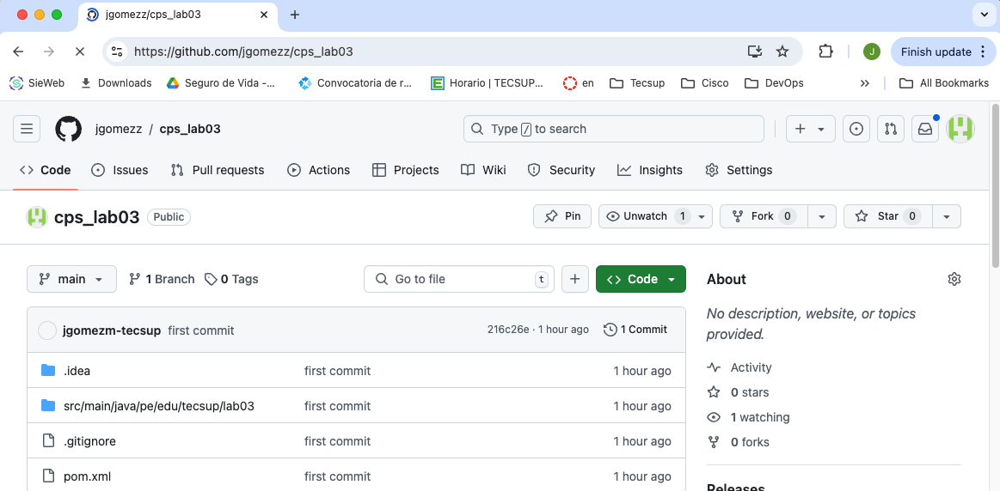

**Análisis de la imagen (fig. 17 — `image40.png`)**

El repositorio ya tiene contenido:

- Selector de branch: **main** · **1 Branch** · **0 Tags**
- Barra de commit: autor **`jgomezm-tecsup`**, mensaje **first commit**, hash **`216c26e`**, *1 hour ago*, contador **1 Commit**.
- Listado de archivos, todos con “first commit / 1 hour ago”:
  - 📁 `.idea`
  - 📁 `src/main/java/pe/edu/tecsup/lab03`
  - 📄 `.gitignore`
  - 📄 `pom.xml`
- Panel **About**: “No description, website, or topics provided.” — 0 stars, 1 watching, 0 forks.

> **Observación:** el propietario del repo es `jgomezz` pero el autor del commit es `jgomezm-tecsup` — son dos cuentas distintas del mismo docente (una personal, otra institucional).

#### 6.1.9 [Colaborador(es)] Bajar el proyecto desde el repositorio remoto de GitHub

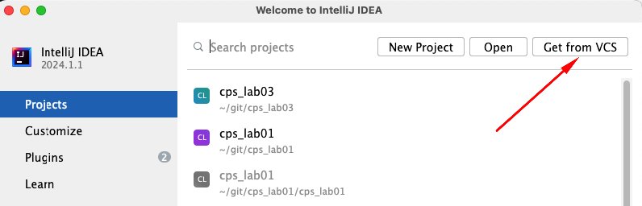

**Análisis de la imagen (fig. 18 — `image42.png`)**

Pantalla de bienvenida de **IntelliJ IDEA 2024.1.1**. Menú lateral: Projects (activo), Customize, Plugins (badge 2), Learn. Lista de proyectos recientes: `cps_lab03` (~/git/cps_lab03), `cps_lab01` (~/git/cps_lab01), `cps_lab01` (~/git/cps_lab01/cps_lab01).

Arriba a la derecha, tres botones: **New Project** · **Open** · **Get from VCS** — este último señalado por una **flecha roja**.

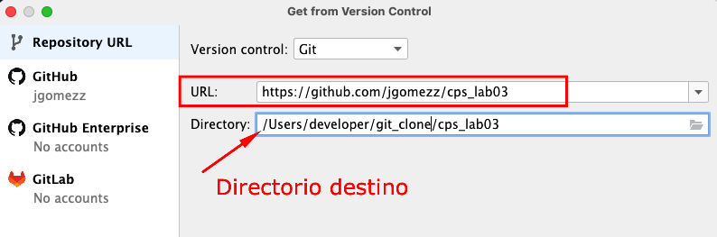

**Análisis de la imagen (fig. 19 — `image46.png`)**

Diálogo **Get from Version Control**:

- Barra lateral: **Repository URL** (activo), GitHub (`jgomezz`), GitHub Enterprise (*No accounts*), GitLab (*No accounts*).
- **Version control:** `Git`
- **URL:** `https://github.com/jgomezz/cps_lab03` (recuadro rojo)
- **Directory:** `/Users/developer/git_clone/cps_lab03` (recuadro azul), con flecha roja y la leyenda **“Directorio destino”**.

**Equivalente CLI:** `git clone https://github.com/jgomezz/cps_lab03.git ~/git_clone/cps_lab03`

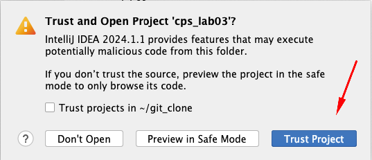

**Análisis de la imagen (fig. 20 — `image41.png`)**

Diálogo de seguridad de IntelliJ:

> ⚠️ **Trust and Open Project 'cps_lab03'?**
> “IntelliJ IDEA 2024.1.1 provides features that may execute potentially malicious code from this folder. If you don't trust the source, preview the project in the safe mode to only browse its code.”

Casilla ☐ *Trust projects in ~/git_clone*. Botones: **Don't Open** · **Preview in Safe Mode** · **Trust Project** (azul, señalado por flecha roja).

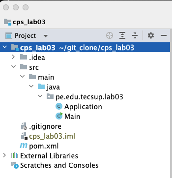

**Análisis de la imagen (fig. 21 — `image4.png`)**

Panel Project del **colaborador**, con la ruta reveladora **`cps_lab03  ~/git_clone/cps_lab03`** (distinta de `~/git/cps_lab03` del responsable):

```
cps_lab03  ~/git_clone/cps_lab03
├── .idea
├── src/main/java/pe.edu.tecsup.lab03
│   ├── Application
│   └── Main
├── .gitignore
├── cps_lab03.iml     (en verde)
└── pom.xml
External Libraries · Scratches and Consoles
```

Ambas clases aparecen en color normal (versionadas y sin cambios locales) — el clon fue exitoso.

---

### 6.2 Cambios en el Proyecto — Branch (`sprint-1`)

#### 6.2.1 [Responsable] Crear el branch `sprint-1`

**Opción:** `Git → New Branch…`

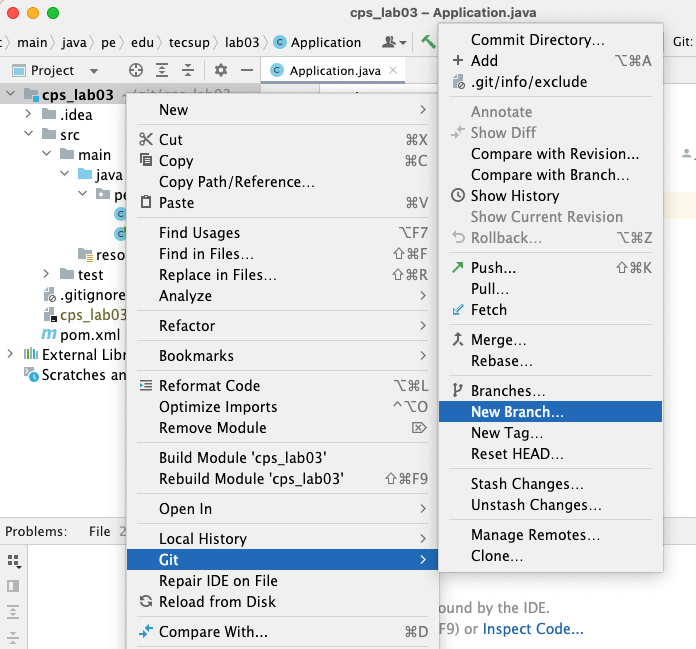

**Análisis de la imagen (fig. 22 — `image23.png`)**

Clic derecho sobre `cps_lab03` → **Git ▸** → **New Branch…** resaltado en azul. Breadcrumb superior: `main › java › pe › edu › tecsup › lab03 › © Application`, y a la izquierda del breadcrumb el indicador de branch actual **`main`**.

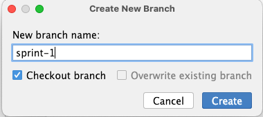

**Análisis de la imagen (fig. 23 — `image17.png`)**

Modal **Create New Branch**:

- **New branch name:** `sprint-1`
- ✅ **Checkout branch** (marcado) → tras crearlo, IntelliJ conmuta automáticamente a él.
- ☐ *Overwrite existing branch* (deshabilitado).
- Botones **Cancel** / **Create**.

**Equivalente CLI:** `git checkout -b sprint-1`

#### 6.2.2 [Responsable] Conmutar al branch `main`

**Ruta:** menú principal `Git → Branches…`

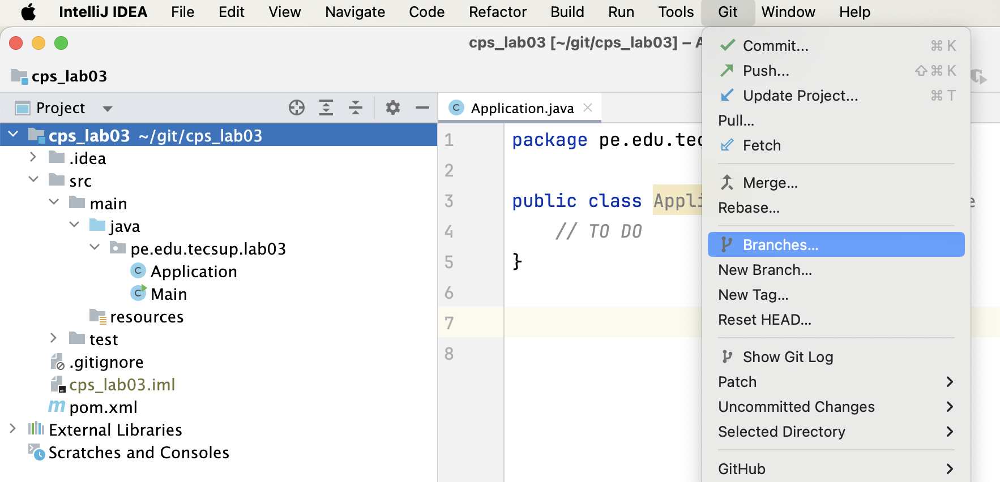

**Análisis de la imagen (fig. 24 — `image22.png`)**

Captura en alta resolución de la barra de menús de macOS con el menú **Git** desplegado y **Branches…** resaltado en azul. Título de ventana: `cps_lab03 [~/git/cps_lab03] – A…`. En el árbol se ven `Application` y `Main`; en el editor, el esqueleto de `Application.java`. Menú completo: Commit ⌘K, Push ⇧⌘K, Update Project ⌘T, Pull…, Fetch, Merge…, Rebase…, **Branches…**, New Branch…, New Tag…, Reset HEAD…, Show Git Log, Patch ▸, Uncommitted Changes ▸, Selected Directory ▸, GitHub ▸.

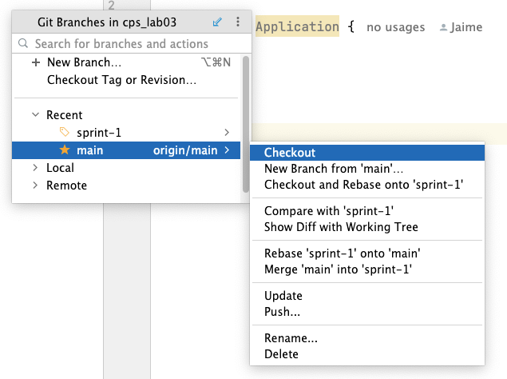

**Análisis de la imagen (fig. 25 — `image18.png`)**

Popup **Git Branches in cps_lab03** con buscador *“Search for branches and actions”*:

- `+ New Branch… ⌥⌘N` · `Checkout Tag or Revision…`
- **Recent**: 🏷 `sprint-1` · ⭐ **`main`** `origin/main` ← seleccionado en azul
- Secciones plegadas: **Local** · **Remote**

Submenú contextual de `main` desplegado a la derecha:

- **Checkout** ← *resaltado en azul, es la acción a ejecutar*
- New Branch from 'main'… · Checkout and Rebase onto 'sprint-1'
- Compare with 'sprint-1' · Show Diff with Working Tree
- Rebase 'sprint-1' onto 'main' · **Merge 'main' into 'sprint-1'**
- Update · Push…
- Rename… · Delete

**Equivalente CLI:** `git checkout main`

#### 6.2.3 [Responsable] Enviar el branch local `sprint-1` al repositorio remoto

**Ruta:** menú principal `View → Tool Windows → Git`

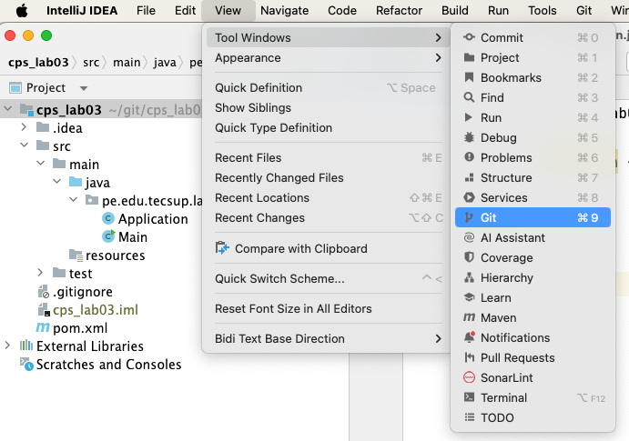

**Análisis de la imagen (fig. 26 — `image20.png`)**

Menú **View → Tool Windows** desplegado; esta vez el resaltado está en **Git ⌘9**. El submenú lista, además de las ventanas ya vistas, **Pull Requests**, **SonarLint**, **Terminal ⌥F12** y **TODO**.

##### Paso 1

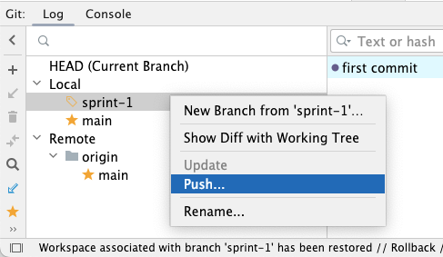

**Análisis de la imagen (fig. 27 — `image26.png`)**

Ventana **Git**, pestañas *Log | Console*. Árbol de referencias:

```
HEAD (Current Branch)
├── Local
│   ├── 🏷 sprint-1     ← seleccionado
│   └── ⭐ main
└── Remote
    └── 📁 origin
        └── ⭐ main      ← nótese: sprint-1 aún NO existe en el remoto
```

Menú contextual sobre `sprint-1`: *New Branch from 'sprint-1'…*, *Show Diff with Working Tree*, *Update* (gris), **Push…** (resaltado en azul), *Rename…*.

A la derecha, el grafo de commits con **`first commit`**. Barra de estado inferior: *“Workspace associated with branch 'sprint-1' has been restored // Rollback…”*.

##### Paso 2

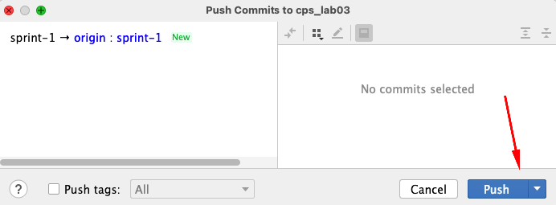

**Análisis de la imagen (fig. 28 — `image25.png`)**

Diálogo **Push Commits to cps_lab03** con la cabecera **`sprint-1 → origin : sprint-1`** y la etiqueta verde **New**. El panel derecho dice **“No commits selected”** — correcto: `sprint-1` no tiene commits propios todavía, sólo se publica la referencia del branch. Flecha roja hacia el botón **Push**.

**Equivalente CLI:** `git push -u origin sprint-1`

##### Paso 3 — Verificar que el branch `sprint-1` aparece en el repositorio remoto

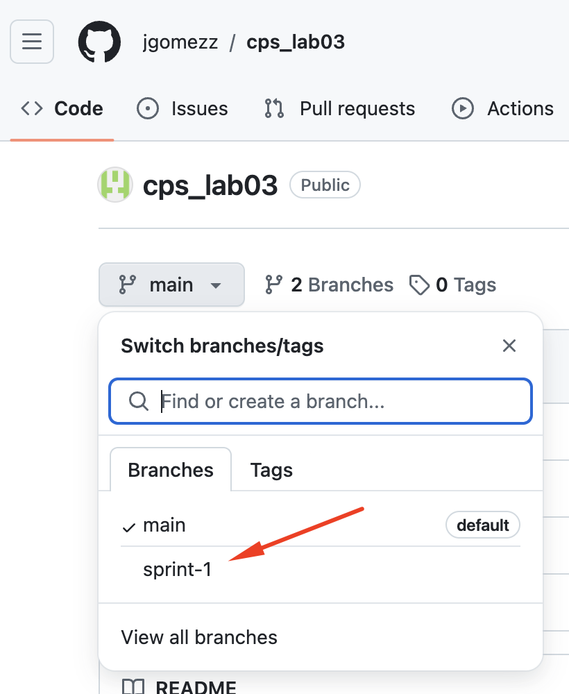

**Análisis de la imagen (fig. 29 — `image24.png`)**

Vista ampliada de GitHub (`jgomezz / cps_lab03`, Public). El contador cambió a **2 Branches** · **0 Tags**. El desplegable **Switch branches/tags** está abierto en la pestaña **Branches**, mostrando:

- ✓ **main** — badge **default**
- **sprint-1** ← señalado por una **flecha roja**
- Enlace *View all branches*

#### 6.2.4 [Colaboradores] Bajar el branch `sprint-1` en el proyecto actual

##### Paso 1

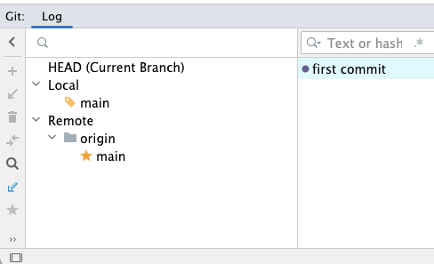
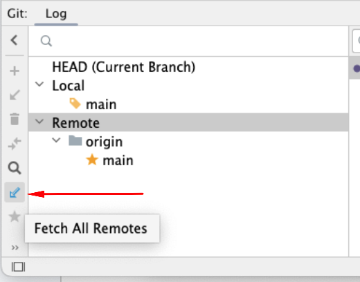

**Análisis de las imágenes (figs. 30–31 — `image21.png`, `image9.png`)**

Ventana **Git** del **colaborador**, en el estado *previo* al fetch:

```
HEAD (Current Branch)
├── Local  → 🏷 main
└── Remote → 📁 origin → ⭐ main
```

`sprint-1` no aparece por ningún lado. En la fig. 31 una **flecha roja** apunta al icono de la barra lateral izquierda (⤓) cuyo **tooltip** dice **“Fetch All Remotes”**.

**Equivalente CLI:** `git fetch --all`

##### Paso 2

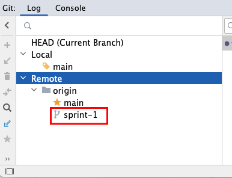

**Análisis de la imagen (fig. 32 — `image14.png`)**

Tras el fetch, el árbol muestra bajo **Remote → origin**: ⭐ `main` y **`sprint-1`** (con ícono de branch, **enmarcado en rojo**). El nodo *Remote* está resaltado en azul.

##### Paso 3 — Se visualiza la referencia al branch remoto `sprint-1`

##### Paso 4

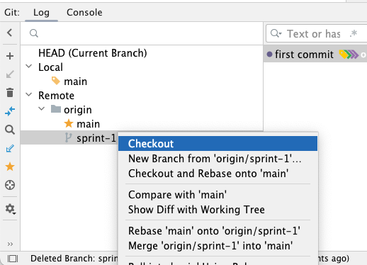

**Análisis de la imagen (fig. 33 — `image15.png`)**

Menú contextual sobre **`origin/sprint-1`**, con **Checkout** resaltado en azul. Otras opciones del menú:

- New Branch from 'origin/sprint-1'…
- Checkout and Rebase onto 'main'
- Compare with 'main' · Show Diff with Working Tree
- Rebase 'main' onto 'origin/sprint-1' · **Merge 'origin/sprint-1' into 'main'**

A la derecha se ve el grafo con `first commit` y etiquetas de refs. La barra inferior muestra un mensaje previo: *“Deleted Branch: sprin…”*.

**Equivalente CLI:** `git checkout sprint-1` (crea el branch local rastreando `origin/sprint-1`)

##### Paso 5 — Se visualiza el branch local `sprint-1`

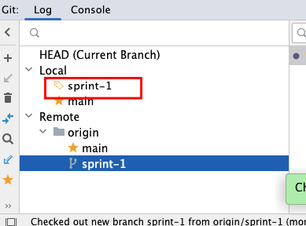

**Análisis de la imagen (fig. 34 — `image8.png`)**

Resultado del checkout:

```
HEAD (Current Branch)
├── Local
│   ├── 🏷 sprint-1   ← ENMARCADO EN ROJO (branch local recién creado)
│   └── ⭐ main
└── Remote → origin
    ├── ⭐ main
    └── sprint-1      ← resaltado en azul
```

Barra de estado: **“Checked out new branch sprint-1 from origin/sprint-1”** — confirmación explícita del tracking.

#### 6.2.5 [Colaboradores] Realizar cambios del proyecto en el repositorio local (add y commit)

Crear las siguientes clases:

| Clase | Paquete completo |
|---|---|
| `StudentController` | `pe.edu.tecsup.lab03.controllers.StudentController` |
| `StudentService` | `pe.edu.tecsup.lab03.services.StudentService` |
| `StudentRepository` | `pe.edu.tecsup.lab03.repositories.StudentRepository` |
| `StudentEntity` | `pe.edu.tecsup.lab03.entities.StudentEntity` |

Es la arquitectura clásica en capas: **Controller → Service → Repository → Entity**.

Luego, **subir los cambios al repositorio remoto del branch `sprint-1` (push)**.

> **NOTA (del documento):** Si se va a subir cambios al repositorio remoto por primera vez y hay cambios en el repositorio remoto que no se han bajado, lo primero que debe hacer es un **Merge**.

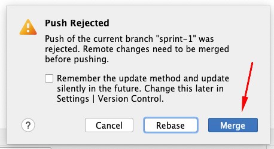

**Análisis de la imagen (fig. 35 — `image12.png`)**

Diálogo de advertencia ⚠️ — **el error más común del laboratorio**:

> **Push Rejected**
> “Push of the current branch **"sprint-1"** was rejected. Remote changes need to be merged before pushing.”

- ☐ *Remember the update method and update silently in the future. Change this later in Settings | Version Control.*
- Botones: **Cancel** · **Rebase** · **Merge** (azul, señalado por **flecha roja** — es la opción que indica el documento).

**Causa:** el historial remoto avanzó respecto al local (non-fast-forward).
**Equivalente CLI:** `git pull` (merge) o `git pull --rebase`, y luego `git push`.

#### 6.2.6 [Responsable] Sincronización

1. Realizar cambios del proyecto en el repositorio local (add y commit) — crear la clase `pe.edu.tecsup.lab03.controllers.StudentController`.
2. Bajar los cambios subidos al repositorio remoto (**pull**).
3. Subir los cambios al repositorio remoto del branch `sprint-1` (**push**).

#### 6.2.7 [Colaboradores] Sincronización

1. Bajar los cambios subidos al repositorio remoto (**pull**).
2. Verificar que no hay diferencias con el proyecto del repositorio remoto.

---

### 6.3 Unificación `main` ← `sprint-1` (merge)

#### 6.3.1 [Responsable] Conmutar al branch `main`

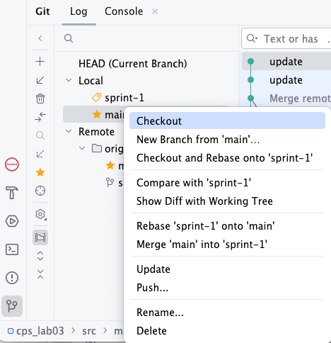

**Análisis de la imagen (fig. 36 — `image5.png`)**

Ventana **Git** (pestañas *Log | Console*) con el árbol:

```
HEAD (Current Branch)
├── Local → 🏷 sprint-1 · ⭐ main   ← clic derecho sobre main
└── Remote → origin → ⭐ main · sprint-1
```

Menú contextual sobre `main` con **Checkout** resaltado en azul. A la derecha, el grafo ya muestra varios commits: **update**, **update**, **Merge remot…** — evidencia de que el trabajo colaborativo en `sprint-1` ya ocurrió.

**Equivalente CLI:** `git checkout main`

#### 6.3.2 [Responsable] Unificar el branch `main` y `sprint-1`

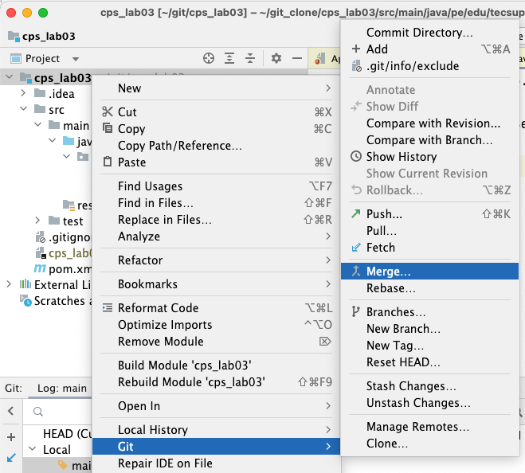

**Análisis de la imagen (fig. 37 — `image11.png`)**

Título de ventana revelador: `cps_lab03 [~/git/cps_lab03] – ~/git_clone/cps_lab03/src/main/java/pe/edu/tecsu…`. Clic derecho en la raíz → **Git ▸** → **Merge…** resaltado en azul. En la parte inferior asoma la ventana `Git: Log: main`.

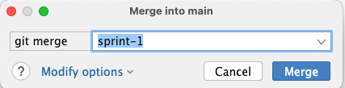

**Análisis de la imagen (fig. 38 — `image6.png`)**

Modal compacto **Merge into main**:

- Etiqueta `git merge` seguida del combo con el valor **`sprint-1`**.
- Enlace **Modify options ˅** (permite `--no-ff`, `--squash`, `--no-commit`, etc.).
- Botones **Cancel** / **Merge**.

**Equivalente CLI:** `git merge sprint-1`

#### 6.3.3 [Responsable] Subir los cambios del `main` al repositorio remoto

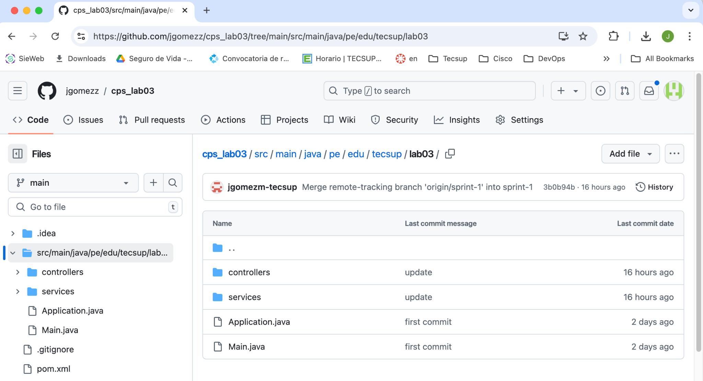

**Análisis de la imagen (fig. 39 — `image16.png`)**

Navegador en `https://github.com/jgomezz/cps_lab03/tree/main/src/main/java/pe/edu/tecsup/lab03`, branch **main**:

- Barra de commit: **`jgomezm-tecsup`** — **“Merge remote-tracking branch 'origin/sprint-1' into sprint-1”** — hash **`3b0b94b`** — *16 hours ago*.
- Contenido del paquete `lab03`:

| Nombre | Último commit | Fecha |
|---|---|---|
| 📁 `controllers` | update | 16 hours ago |
| 📁 `services` | update | 16 hours ago |
| 📄 `Application.java` | first commit | 2 days ago |
| 📄 `Main.java` | first commit | 2 days ago |

- Árbol lateral **Files**: `.idea`, `src/main/java/pe/edu/tecsup/lab…` (expandido: `controllers`, `services`, `Application.java`, `Main.java`), `.gitignore`, `pom.xml`.

> **Observación:** sólo aparecen `controllers` y `services`. Los paquetes `repositories` y `entities` que pide el enunciado **no llegaron a `main`** en esta captura.

---

### 6.4 Generar la versión estable `v1.0.0` (tag) del `main`

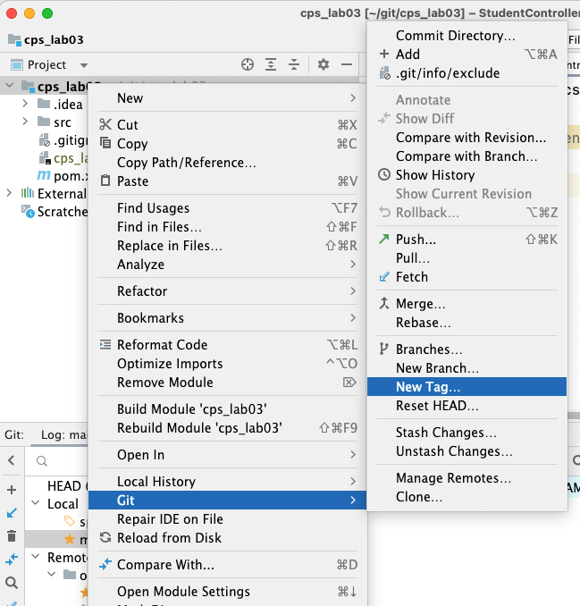

**Análisis de la imagen (fig. 40 — `image2.png`)**

Título de ventana: `cps_lab03 [~/git/cps_lab03] – StudentController…` (ya existe la clase). Clic derecho → **Git ▸** → **New Tag…** resaltado en azul. Al fondo, la ventana `Git: Log: ma…` con el árbol `Local`/`Remot…`.

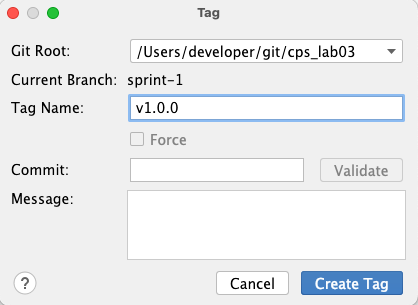

**Análisis de la imagen (fig. 41 — `image7.png`)**

Modal **Tag**:

| Campo | Valor |
|---|---|
| **Git Root** | `/Users/developer/git/cps_lab03` |
| **Current Branch** | **`sprint-1`** |
| **Tag Name** | **`v1.0.0`** (campo activo, borde azul) |
| Force | ☐ deshabilitado |
| Commit | *(vacío)* + botón **Validate** (deshabilitado) |
| Message | *(vacío)* |

Botones **Cancel** / **Create Tag**.

> ⚠️ **Inconsistencia importante:** el enunciado dice *“Generar la versión estable v1.0.0 (tag) del **main**”*, pero la captura muestra **Current Branch: sprint-1**. Al no rellenar el campo *Commit*, el tag se crea sobre el **HEAD del branch actual** — es decir, sobre `sprint-1`, no sobre `main`. **Antes de crear el tag hay que estar posicionado en `main`.**

Además, dejar **Message** vacío produce un **tag ligero (lightweight)**; con mensaje sería un **tag anotado**, que es lo recomendado para releases (`git tag -a v1.0.0 -m "Versión estable 1.0.0"`).

#### Para verificar la creación del Tag

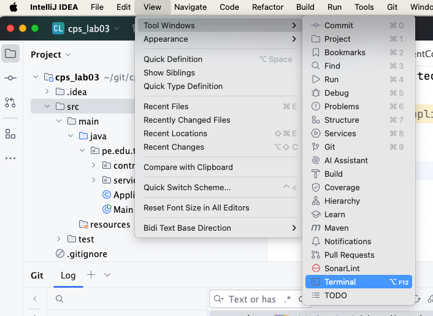

**Análisis de la imagen (fig. 42 — `image19.png`)**

Menú **View → Tool Windows** con **Terminal ⌥F12** resaltado en azul. En el árbol de proyecto (parcialmente tapado) ya se distinguen los paquetes `contr…` (controllers) y `servi…` (services) junto a `Appli…` y `Main`. Abajo se ve la ventana **Git → Log**.

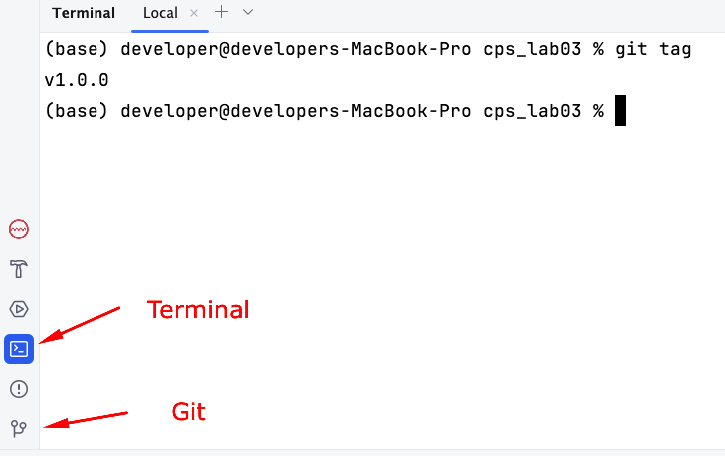

**Análisis de la imagen (fig. 43 — `image1.png`)**

Ventana **Terminal** (pestaña *Local*) con la sesión real:

```
(base) developer@developers-MacBook-Pro cps_lab03 % git tag
v1.0.0
(base) developer@developers-MacBook-Pro cps_lab03 %
```

El comando `git tag` lista los tags existentes y devuelve **`v1.0.0`** ✅. El prefijo `(base)` indica un entorno **conda** activo.

En la barra lateral izquierda, dos **flechas rojas** con etiquetas manuscritas **“Terminal”** (icono ⌨️ resaltado en azul) y **“Git”** (icono de branch) — señalan dónde encontrar cada ventana.

#### Subir el tag al repositorio remoto

El documento deja **en blanco** los apartados *“Para subir un tag”* y *“Para subir todos los tags”*. Comandos correspondientes:

```bash
# Subir un tag específico
git push origin v1.0.0

# Subir todos los tags
git push origin --tags
```

En IntelliJ, la equivalencia es marcar la casilla **Push tags: All** en el diálogo *Push Commits* (visible en las figs. 14, 15 y 28).

#### Eliminar credenciales antiguas de Git (macOS)

> Para eliminar antiguas credenciales de Git almacenadas en la MacBook ir a **Keychain Access**.

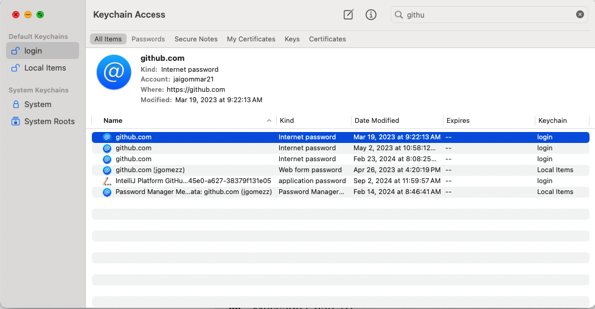

**Análisis de la imagen (fig. 44 — `image13.png`)**

Aplicación **Keychain Access** de macOS, con el filtro de búsqueda **`githu`** y la pestaña *All Items*. Elemento seleccionado:

- **github.com** · Kind: **Internet password** · Account: **jaigommar21** · Where: `https://github.com` · Modified: *Mar 19, 2023 9:22:13 AM*

Lista completa de entradas encontradas:

| Name | Kind | Date Modified | Keychain |
|---|---|---|---|
| github.com | Internet password | Mar 19, 2023 9:22:13 AM | login |
| github.com | Internet password | May 2, 2023 10:58:12… | login |
| github.com | Internet password | Feb 23, 2024 8:08:25… | login |
| github.com (jgomezz) | Web form password | Apr 26, 2023 4:20:19 PM | Local Items |
| IntelliJ Platform GitHu…45e0-a627-38379f131e05 | application password | Sep 2, 2024 11:59:57 AM | login |
| Password Manager Me…ata: github.com (jgomezz) | Password Manager… | Feb 14, 2024 8:46:41 AM | Local Items |

Barras laterales: *Default Keychains* (login, Local Items) y *System Keychains* (System, System Roots).

**Por qué importa:** credenciales viejas cacheadas provocan fallos de autenticación en `push`/`pull` (el famoso *“Authentication failed”*) aunque el token nuevo sea correcto. Hay que **borrar las entradas obsoletas** de `github.com`.

**Equivalentes en otros sistemas:**

```bash
# macOS (línea de comandos)
git credential-osxkeychain erase

# Windows — Administrador de credenciales
# Panel de Control → Cuentas de usuario → Administrador de credenciales
#   → Credenciales de Windows → git:https://github.com → Quitar
cmdkey /list
```

> ⚠️ **Advertencia:** esta captura expone nombres de cuenta reales (`jaigommar21`, `jgomezz`) y el inventario de credenciales del docente. Es información sensible que no debería figurar en un material distribuido a alumnos.

#### Verificar cambios en el GitHub

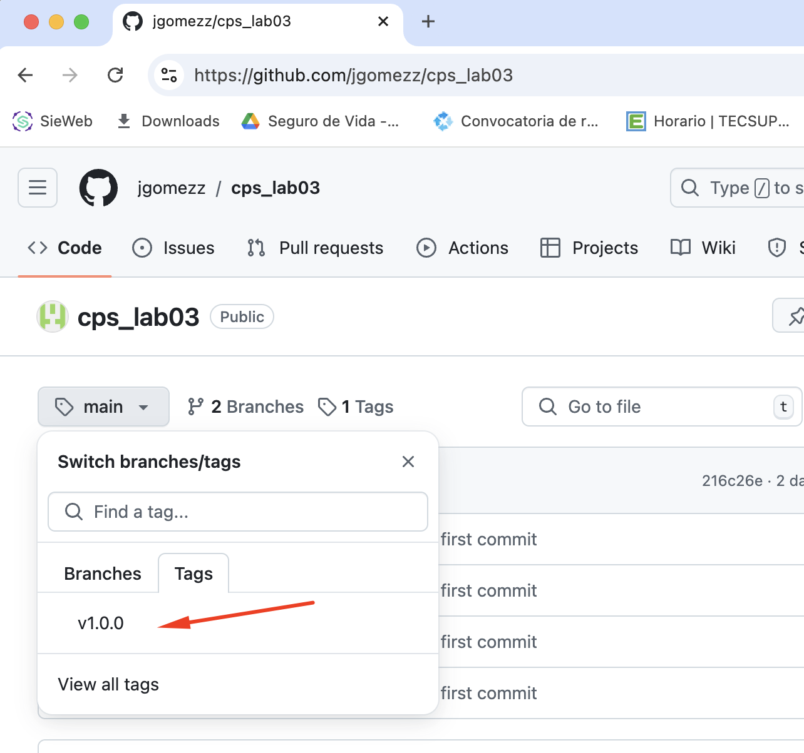

**Análisis de la imagen (fig. 45 — `image10.png`)**

Vista ampliada del repositorio con los contadores actualizados: **2 Branches** · **1 Tags**. El desplegable **Switch branches/tags** está abierto en la pestaña **Tags**, con el buscador *“Find a tag…”* y una única entrada:

- **v1.0.0** ← señalada por una **flecha roja**
- Enlace *View all tags*

Al fondo, el listado de archivos con “first commit” y el hash `216c26e`.

✅ **Confirmación final:** el tag `v1.0.0` está publicado en el repositorio remoto.

#### [Colaboradores] Bajar los cambios realizados

```bash
git pull
git fetch --tags
```

---

## 7. Ejercicio adicional — Calificado

### 7.1 Cambios en el Proyecto — Branch (`sprint-2`)

#### [Responsable]

1. Crear un branch del proyecto (desde el IDE) llamado: **`sprint-2`**
2. Subir el branch al repositorio remoto (**push**)

#### [Colaboradores]

1. Bajar el proyecto del branch `sprint-2` (**checkout**)
2. Realizar cambios del proyecto en el repositorio local (**add** y **commit**):
   - Modificar la clase: `pe.edu.tecsup.lab03.services.StudentController` *(sic — ver nota)*
   - Modificar la clase: `pe.edu.tecsup.lab03.services.StudentService`
   - Modificar la clase: `pe.edu.tecsup.lab03.repositories.StudentRepository`
   - Modificar la clase: `pe.edu.tecsup.lab03.entities.StudentEntity`
3. Subir los cambios al repositorio remoto del branch `sprint-2`

> ⚠️ **Errata del documento:** dice `pe.edu.tecsup.lab03.`**`services`**`.StudentController`; debería ser `pe.edu.tecsup.lab03.`**`controllers`**`.StudentController`, como sí figura correctamente en la sección del Responsable y en el paso 6.2.5.

#### [Responsable]

1. Realizar cambios del proyecto (`sprint-2`) en el repositorio local (add y commit):
   - Modificar la clase: `pe.edu.tecsup.lab03.controllers.StudentController`
2. Bajar los cambios subidos al repositorio remoto (**pull**)
3. Unificar los cambios (**merge**)
4. Subir los cambios al repositorio remoto del branch `sprint-2`

#### [Colaborador]

1. Bajar los cambios subidos al repositorio remoto (**pull**)
2. Verificar que no hay diferencias con el proyecto del repositorio remoto

### 7.2 Unificar branches del Proyecto — (`main` y `sprint-2`)

#### [Responsable]

1. Conmutar al branch principal: **`main`**
2. Unificar con el branch `sprint-2` (**merge**)
3. Subir cambios al repositorio local (**add** y **commit**)
4. Subir cambios al repositorio remoto (**push**)
5. Generar versión estable **`1.1.0`** (tag) y subirlo al GitHub

> **Nota de nomenclatura:** el enunciado escribe `1.1.0` sin la `v`, mientras que el primer tag fue `v1.0.0`. Se recomienda mantener la coherencia y usar **`v1.1.0`**.

---

## 8. Conclusiones

> *Indicar las conclusiones que ha llegado después de desarrollar el laboratorio.*

1. _______________________________________________
2. _______________________________________________
3. _______________________________________________

*(Sección a completar por el alumno. Vale 2 puntos en la rúbrica y se descuenta 1 punto por errores de ortografía y redacción.)*

---

## 9. Criterios de evaluación — Rúbrica


**Análisis de la imagen (fig. 46 — `image3.jpg`)** — Logotipo institucional **TECSUP** en JPG (isotipo de flechas circulares azules + tipografía negra). Es el único JPG del documento; va en la celda superior izquierda de la tabla de la rúbrica. La fig. 01 (`image35.png`) es la variante con el eslogan *“Pasión por la Tecnología”*, usada en la portada.

### Encabezado de la rúbrica

| Campo | Valor |
|---|---|
| Curso | Construcción y Pruebas de Software |
| Periodo | *(en blanco)* |
| Actividad | Realizar control de versiones |
| Semestre | IV |
| Nombre del Alumno | *(en blanco)* |
| Semana | 3 |
| Docente | Jaime Gómez |
| Fecha / Sección | *(en blanco)* |

### Tabla de puntajes

| Criterios a evaluar | Excelente | Bueno | Requiere Mejora | No Aceptable | Puntaje logrado |
|---|:---:|:---:|:---:|:---:|:---:|
| Uso de **branches** en proyectos | 6 | 5 | 3 | 2-0 | |
| Uso de **merges** en proyectos | 6 | 5 | 3 | 1-0 | |
| Uso de **Tags** en proyectos | 6 | 4 | 4 | 2-0 | |
| **Conclusiones** | 2 | 1 | 0 | 0 | |
| **Total** | **20** | **15** | **10** | **05** | |

> **Nota:** la fila de *Tags* tiene 4 puntos tanto en “Bueno” como en “Requiere Mejora” — probablemente una errata del documento original.

### Descuentos

| Acciones a cumplir | Menos |
|---|:---:|
| Puntualidad y dedicación | 1 |
| Cumplimiento de tiempos establecidos | 1 |
| Conclusiones: ortografía y redacción | 1 |
| **Puntaje Total** | |

| Comentarios respecto del desempeño del alumno |
|---|
| /  /  /  / |

### Escala de desempeño

| Nivel | Descripción |
|---|---|
| **Excelente** | Demuestra un completo entendimiento del problema o realiza la actividad cumpliendo todos los requerimientos especificados. |
| **Bueno** | Demuestra un considerable entendimiento del problema o realiza la actividad cumpliendo con la mayoría de los requerimientos especificados. |
| **Requiere Mejora** | Demuestra un bajo entendimiento del problema o realiza la actividad con pocos de los requerimientos especificados. |
| **No aceptable** | No demuestra entendimiento del problema o actividad. |

---

## Anexo A — Catálogo completo de imágenes analizadas

Las 46 imágenes fueron extraídas de `word/media/` del `.docx` y **renombradas según su orden de aparición** en el documento (`figNN_imageXX`). El nombre original se conserva en el sufijo.

| # | Archivo | Original | Tipo | Contenido |
|:---:|---|---|---|---|
| 01 | `fig01_image35.png` | image35 | Logo | Logo TECSUP con eslogan “Pasión por la Tecnología” (portada) |
| 02 | `fig02_image28.png` | image28 | GitHub Web | Repositorio `cps_lab03` vacío — quick setup + URL de clonado |
| 03 | `fig03_image27.png` | image27 | GitHub Web | Settings → Collaborators → botón **Add people** |
| 04 | `fig04_image29.png` | image29 | IntelliJ | Diálogo **New Project**: Java + Maven + corretto-17 + GroupId/ArtifactId |
| 05 | `fig05_image36.png` | image36 | IntelliJ | Árbol Maven inicial con la clase `Main` |
| 06 | `fig06_image30.png` | image30 | IntelliJ | Árbol con `Application` (rojo) y `Main` (verde) |
| 07 | `fig07_image32.png` | image32 | Editor | Código de `Application.java` (5 líneas, `// TO DO`) |
| 08 | `fig08_image37.png` | image37 | IntelliJ | Menú contextual **Git ▸ Add ⌥⌘A** |
| 09 | `fig09_image45.png` | image45 | IntelliJ | Menú contextual **Git ▸ Commit Directory…** |
| 10 | `fig10_image43.png` | image43 | IntelliJ | Menú principal **Git ▸ Commit… ⌘K** |
| 11 | `fig11_image31.png` | image31 | IntelliJ | Ventana **Commit to main** — 18 files, mensaje `first commit` |
| 12 | `fig12_image39.png` | image39 | IntelliJ | **View → Tool Windows → Project ⌘1** |
| 13 | `fig13_image38.png` | image38 | IntelliJ | Menú contextual **Git ▸ Push… ⇧⌘K** |
| 14 | `fig14_image34.png` | image34 | IntelliJ | **Define Remote**: `origin` → URL del repo |
| 15 | `fig15_image33.png` | image33 | IntelliJ | **Push Commits**: `main → origin : main` (New), 18 files |
| 16 | `fig16_image44.png` | image44 | Auth | **Log In to GitHub** — *Use Token…* / *Log In via GitHub…* |
| 17 | `fig17_image40.png` | image40 | GitHub Web | Repo con `first commit` (`216c26e`), 1 Branch, 0 Tags |
| 18 | `fig18_image42.png` | image42 | IntelliJ | Welcome screen 2024.1.1 → **Get from VCS** |
| 19 | `fig19_image46.png` | image46 | IntelliJ | **Get from Version Control**: URL + directorio destino `~/git_clone` |
| 20 | `fig20_image41.png` | image41 | IntelliJ | **Trust and Open Project 'cps_lab03'?** |
| 21 | `fig21_image4.png` | image4 | IntelliJ | Proyecto clonado en `~/git_clone/cps_lab03` (vista colaborador) |
| 22 | `fig22_image23.png` | image23 | IntelliJ | Menú contextual **Git ▸ New Branch…** |
| 23 | `fig23_image17.png` | image17 | IntelliJ | **Create New Branch**: `sprint-1` + ✅ Checkout branch |
| 24 | `fig24_image22.png` | image22 | IntelliJ | Menú principal **Git ▸ Branches…** (alta resolución) |
| 25 | `fig25_image18.png` | image18 | IntelliJ | Popup **Git Branches** → `main` → **Checkout** |
| 26 | `fig26_image20.png` | image20 | IntelliJ | **View → Tool Windows → Git ⌘9** |
| 27 | `fig27_image26.png` | image26 | IntelliJ | Ventana Git → `sprint-1` local → **Push…** |
| 28 | `fig28_image25.png` | image25 | IntelliJ | **Push Commits**: `sprint-1 → origin : sprint-1` (New), sin commits |
| 29 | `fig29_image24.png` | image24 | GitHub Web | Switch branches: **2 Branches** — `main` (default) + `sprint-1` |
| 30 | `fig30_image21.png` | image21 | IntelliJ | Ventana Git del colaborador: sólo `main` local y remoto |
| 31 | `fig31_image9.png` | image9 | IntelliJ | Tooltip **Fetch All Remotes** (⤓) |
| 32 | `fig32_image14.png` | image14 | IntelliJ | Tras el fetch: `origin/sprint-1` visible (recuadro rojo) |
| 33 | `fig33_image15.png` | image15 | IntelliJ | Menú contextual sobre `origin/sprint-1` → **Checkout** |
| 34 | `fig34_image8.png` | image8 | IntelliJ | Branch local `sprint-1` creado — “Checked out new branch…” |
| 35 | `fig35_image12.png` | image12 | Error | **Push Rejected** → botones Rebase / **Merge** |
| 36 | `fig36_image5.png` | image5 | IntelliJ | Ventana Git → `main` → **Checkout** (grafo con *update*, *Merge remot…*) |
| 37 | `fig37_image11.png` | image11 | IntelliJ | Menú contextual **Git ▸ Merge…** |
| 38 | `fig38_image6.png` | image6 | IntelliJ | **Merge into main** ← `git merge sprint-1` |
| 39 | `fig39_image16.png` | image16 | GitHub Web | `main` con “Merge remote-tracking branch 'origin/sprint-1'…” (`3b0b94b`), carpetas `controllers` y `services` |
| 40 | `fig40_image2.png` | image2 | IntelliJ | Menú contextual **Git ▸ New Tag…** |
| 41 | `fig41_image7.png` | image7 | IntelliJ | Diálogo **Tag**: `v1.0.0` (Current Branch: `sprint-1` ⚠️) |
| 42 | `fig42_image19.png` | image19 | IntelliJ | **View → Tool Windows → Terminal ⌥F12** |
| 43 | `fig43_image1.png` | image1 | Terminal | `git tag` → **`v1.0.0`** ✅ |
| 44 | `fig44_image13.png` | image13 | macOS | **Keychain Access** — credenciales `github.com` a depurar |
| 45 | `fig45_image10.png` | image10 | GitHub Web | Switch tags: **1 Tags** — `v1.0.0` publicado |
| 46 | `fig46_image3.jpg` | image3 | Logo | Logo TECSUP (JPG) para la cabecera de la rúbrica |

**Distribución por tipo:**

| Tipo | Cantidad |
|---|:---:|
| Capturas de IntelliJ IDEA (menús, diálogos, paneles) | 31 |
| Capturas de GitHub web | 6 |
| Diálogos de sistema / error / autenticación | 4 |
| Terminal | 1 |
| macOS Keychain Access | 1 |
| Editor de código | 1 |
| Logotipos institucionales | 2 |

> **Nota técnica:** el `.docx` contiene además `image48.png`, un archivo de **70 bytes** (PNG diminuto, probablemente un separador o resto de edición) que **no está referenciado** en el cuerpo del documento y por eso no se incluye en el catálogo. No existe `image47`.

---

## Anexo B — Chuleta de comandos Git equivalentes

Todo el laboratorio se realiza con la GUI de IntelliJ. Estos son los comandos equivalentes, en el orden del laboratorio:

### Configuración inicial y primer push (Responsable)

```bash
cd ~/git/cps_lab03
git init                                   # (lo hace "Create Git repository" del New Project)
git add .                                  # Git > Add
git commit -m "first commit"               # Git > Commit
git remote add origin https://github.com/jgomezz/cps_lab03.git
git branch -M main
git push -u origin main                    # Git > Push
```

### Clonado (Colaborador)

```bash
git clone https://github.com/jgomezz/cps_lab03.git ~/git_clone/cps_lab03
cd ~/git_clone/cps_lab03
```

### Branching

```bash
git checkout -b sprint-1        # Git > New Branch (+ Checkout branch)
git push -u origin sprint-1     # publicar el branch en el remoto
git checkout main               # Git > Branches > main > Checkout
git branch -a                   # listar todos los branches (local + remoto)
```

### Traer el branch remoto (Colaborador)

```bash
git fetch --all                 # icono "Fetch All Remotes"
git branch -r                   # ver origin/sprint-1
git checkout sprint-1           # crea el branch local rastreando origin/sprint-1
```

### Ciclo de trabajo diario

```bash
git status
git add .
git commit -m "update"
git pull                        # ANTES del push, si el remoto avanzo
git push
```

### Resolver "Push Rejected"

```bash
git pull                        # opcion "Merge" del dialogo
# o bien:
git pull --rebase               # opcion "Rebase"
git push
```

### Merge hacia main

```bash
git checkout main
git merge sprint-1              # Git > Merge > sprint-1
git push origin main
```

### Tags

```bash
git checkout main                                # posicionarse en main ANTES
git tag v1.0.0                                   # tag ligero (lo que hace la captura)
git tag -a v1.0.0 -m "Version estable 1.0.0"     # tag anotado (recomendado)
git tag                                          # listar tags
git show v1.0.0                                  # ver detalle
git push origin v1.0.0                           # subir UN tag
git push origin --tags                           # subir TODOS los tags
git fetch --tags                                 # el colaborador baja los tags
```

### Ejercicio calificado (sprint-2)

```bash
git checkout main
git checkout -b sprint-2
git push -u origin sprint-2
# ... cambios, add, commit, pull, push ...
git checkout main
git merge sprint-2
git push origin main
git tag -a v1.1.0 -m "Version estable 1.1.0"
git push origin v1.1.0
```

### Limpieza de credenciales

```bash
# macOS
git credential-osxkeychain erase
# (o desde la app Keychain Access, buscando "github")

# Windows
cmdkey /list
# Panel de Control > Administrador de credenciales > git:https://github.com > Quitar
```

---

## Anexo C — Observaciones y hallazgos del análisis

### C.1 Inconsistencias detectadas en el documento

| # | Ubicación | Problema | Corrección sugerida |
|:---:|---|---|---|
| 1 | §6.1.1 (texto) vs fig. 02 | El texto pide crear el repo **`cps_lab03b`**; todas las capturas usan **`cps_lab03`** | Unificar a `cps_lab03` |
| 2 | fig. 41 (diálogo Tag) | **Current Branch: `sprint-1`** cuando el enunciado pide taggear **`main`** | Hacer `checkout main` antes de crear el tag |
| 3 | §7.1 (Colaboradores) | Dice `...services.StudentController` | Debe ser `...controllers.StudentController` |
| 4 | §7.2, paso 5 | Tag escrito como **`1.1.0`** (sin `v`), mientras el primero fue `v1.0.0` | Usar `v1.1.0` |
| 5 | §2 (Recursos) | Indica **Windows XP o superior**; todas las capturas son de **macOS** | Añadir equivalencias Windows o rehacer capturas |
| 6 | §9 (Rúbrica) | Fila *Tags*: **4 puntos** tanto en “Bueno” como en “Requiere Mejora” | Revisar la escala (probable 4 / 3) |
| 7 | §6.4 | Los apartados *“Para subir un tag”* y *“Para subir todos los tags”* están **vacíos** | Completar con `git push origin <tag>` y `git push origin --tags` |
| 8 | fig. 39 vs §6.2.5 | En `main` sólo llegaron `controllers` y `services`; faltan `repositories` y `entities` | Verificar que las 4 clases se creen y se mergeen |

### C.2 Datos personales expuestos

Las capturas contienen información identificable que conviene revisar antes de redistribuir el material:

- Usuarios de GitHub: **`jgomezz`**, **`jgomezm-tecsup`**
- Cuentas en Keychain (fig. 44): **`jaigommar21`**, **`jgomezz`** — junto con el inventario de contraseñas de `github.com` y sus fechas.
- Rutas locales del docente: `/Users/developer/git/…`, `~/git_clone/…`
- Barra de marcadores del navegador: SieWeb, Seguro de Vida, Convocatoria de r…, Horario TECSUP, Tecsup, Cisco, DevOps.

### C.3 Entorno técnico documentado en las capturas

| Elemento | Valor observado |
|---|---|
| Sistema operativo | macOS (MacBook Pro) |
| IDE | IntelliJ IDEA **2024.1.1** |
| JDK | Amazon **Corretto 17.0.11** |
| Build system | **Maven** |
| Navegador | Google Chrome |
| Shell | zsh con entorno **conda** activo (`(base)`) |
| Branch por defecto | `main` |
| Plugins visibles | SonarLint, AI Assistant, Pull Requests |
| Hash del primer commit | `216c26e` |
| Hash del merge | `3b0b94b` |

### C.4 Conceptos de Git cubiertos por el laboratorio

| Concepto | Dónde aparece | Comando |
|---|---|---|
| Inicializar repositorio | fig. 04 (checkbox) | `git init` |
| Stage Area | figs. 06–08 | `git add` |
| Commit local | figs. 09–11 | `git commit` |
| Remote | fig. 14 | `git remote add` |
| Push (primera vez) | figs. 13, 15–16 | `git push -u origin main` |
| Clone | figs. 18–21 | `git clone` |
| Crear branch | figs. 22–23 | `git checkout -b` |
| Conmutar branch | figs. 24–25, 36 | `git checkout` |
| Publicar branch | figs. 27–29 | `git push -u origin sprint-1` |
| Fetch | figs. 30–32 | `git fetch --all` |
| Checkout de branch remoto | figs. 33–34 | `git checkout sprint-1` |
| Conflicto de push | fig. 35 | `git pull` / `git pull --rebase` |
| Merge | figs. 37–39 | `git merge` |
| Tag | figs. 40–41, 43, 45 | `git tag`, `git push --tags` |
| Gestión de credenciales | figs. 16, 44 | PAT / Keychain |

### C.5 Flujo de trabajo resumido

```
Responsable                                    Colaborador
-----------                                    -----------
crea repo GitHub (cps_lab03)
invita colaborador  ------------------------->  acepta invitacion por correo
crea proyecto Maven (~/git)
add + commit "first commit"
push -u origin main  ------------------------>  clone (~/git_clone)
crea branch sprint-1
push -u origin sprint-1  -------------------->  fetch --all
                                                checkout origin/sprint-1
                                                crea Controller/Service/
                                                     Repository/Entity
                                                add + commit
                        <---------------------  push  (posible Push Rejected -> Merge)
pull
crea StudentController
push  --------------------------------------->  pull -> verificar sin diferencias
checkout main
merge sprint-1
push origin main
tag v1.0.0 (desde main)
push origin --tags  ------------------------->  pull + fetch --tags
```

---

*Documento generado a partir del análisis completo de `GLAB-S03-2026-02-1.docx` — texto íntegro transcrito, 4 tablas reconstruidas y las 46 imágenes extraídas y analizadas una por una.*
